# Zinthos

> *Aeolian · Melodion · Zinthos*

**Zinthos** is a music search and discovery engine over **~255 million tracks** and **~400 million artist associations**. It lets you search for music by how it *sounds* and *feels* — combining rule-based audio-feature filtering, machine-learned genre prediction and learned embeddings, and an LLM fallback for natural-language queries.

The whole pipeline — a 266 GB raw-data ETL, genre classification over 255M rows, a supervised autoencoder, a FAISS vector index, a FastAPI engine, and a Rust terminal client — runs on a single 15 GB-RAM / 6 GB-VRAM machine.

---

## Demo

Two clients, one engine. Everything below is live against the full **255M-track** index.

### Web client

The portal: a landing screen you jump *through* into a four-way mode selector, each door
wired to a real engine endpoint.

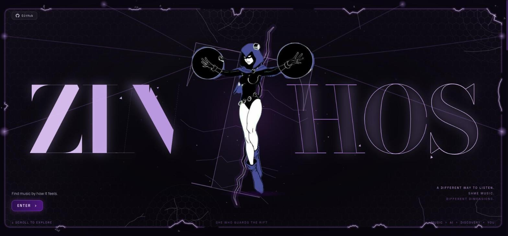

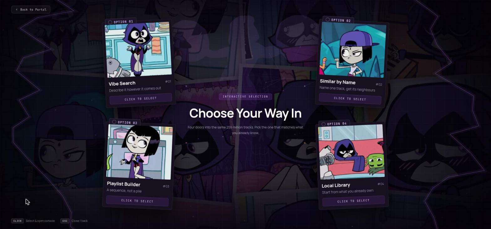

Describing a vibe in your own words. `rainy 3am drive, warm bass, nothing cheerful` matches
almost nothing in the rules vocabulary, so the LLM fallback turns the phrase into feature
filters and the engine ranks 255M tracks by feel.

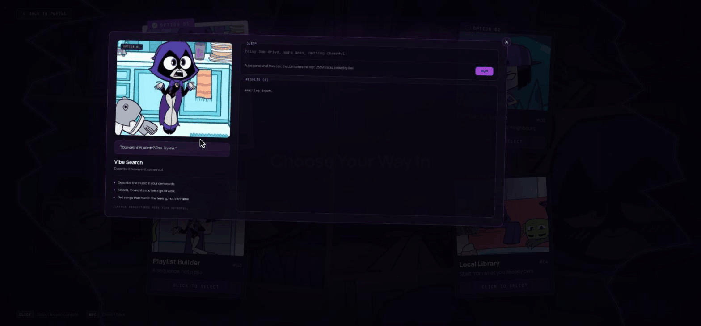

Naming a track you already know. `Midnight City` / `M83` resolves to the catalogue copies
first — a pick-list, because a famous song has many — and the chosen one becomes the seed for
a walk through the learned embedding space.

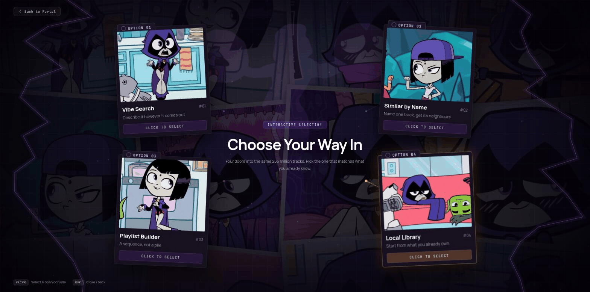

Describing an arc rather than a mood. The same filters as vibe search, then ordered so the
jump between consecutive tracks stays small (tempo, energy, Camelot key, valence).

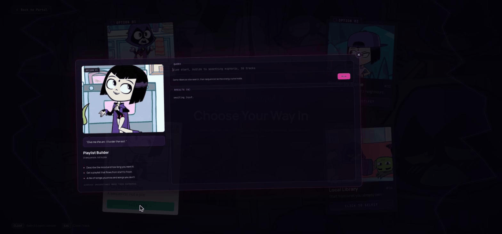

Starting from what you already own. Paste `Title — Artist` per line, optionally with an ISRC;
each line is matched to the catalogue — by ISRC exactly, otherwise fuzzily — and every match
becomes a seed. Retrieval runs inside each seed's own genre family, so a metal shelf comes
back metal rather than whatever happens to sit near the average of it.

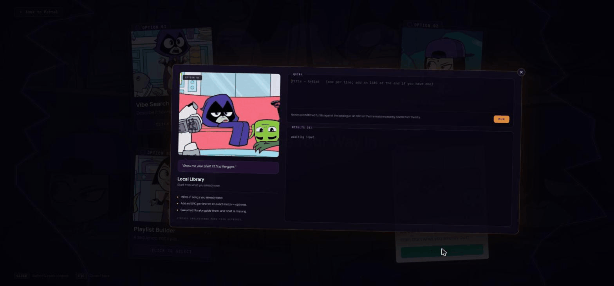

### Terminal client

Searching by feel — a vibe query (`dark moody instrumental electronic`) returns real tracks; `s` pulls nearest neighbours from the FAISS index ("more like this").

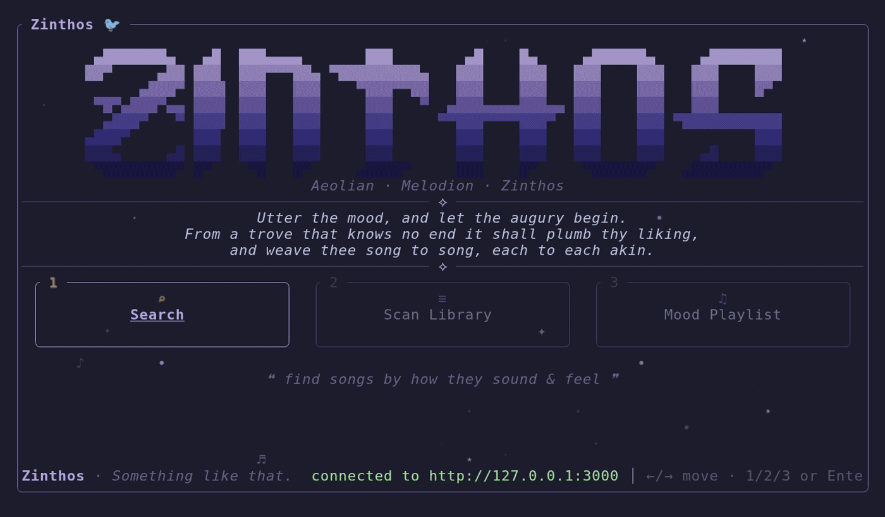

Finding songs like one you already know — name a track (`Midnight City` / `M83`), pick it out of the catalog candidates, and get its nearest neighbours; `s` again chases the thread one hop further.

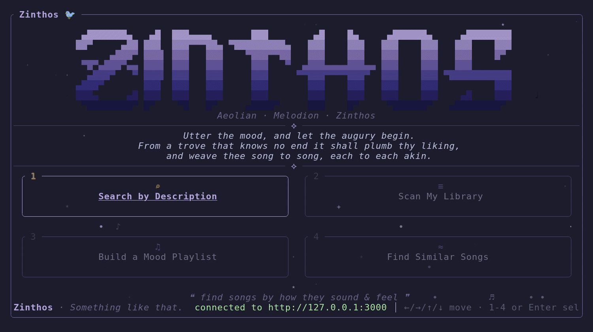

Building a mood playlist — describe a vibe (`energetic upbeat happy dance pop`) and get a smoothly transition-ordered set.

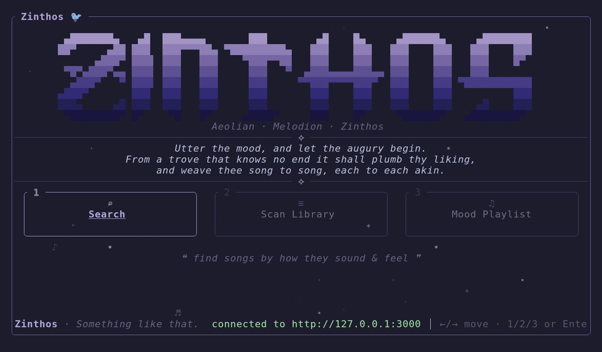

Scanning a local library — point it at a folder of audio files; it reads their tags, identity-matches them against the catalog, maps your taste (genre + era breakdown), and recommends more.

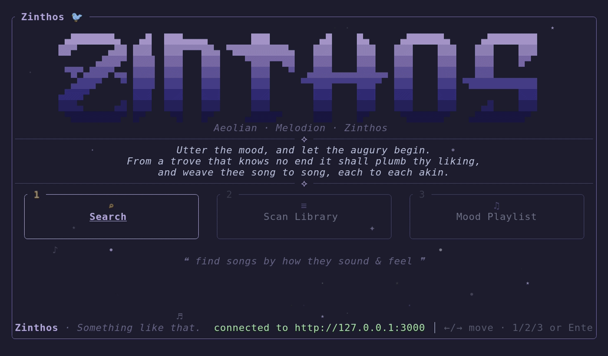

> Both clients talk to the FastAPI engine over JSON and hold no data of their own.

### Try it

A public demo runs the same engine over a **slice** of the catalogue — the full `master.db`
is 162 GB and the FAISS index 9 GB, neither of which fits a free host. No code is forked: the
slice keeps `master.db`'s track ids and every column the engine reads, and
[`backend/engine/config.py`](backend/engine/config.py) is pointed at it by environment
variable. It says which slice it is serving, live from the engine, rather than claiming the
whole catalogue. See [`demo/`](demo/) for how it is built and deployed.

## Architecture

```
 266 GB raw data            C++ ETL              Python ML                FastAPI engine        Rust TUI
┌──────────────────┐   ┌──────────────┐   ┌──────────────────────┐   ┌────────────────┐   ┌──────────┐
│ source_a         │   │ master_db_   │   │ LightGBM genre clf    │   │ /search        │   │ ratatui  │
│ audio_features   │──▶│ builder.cpp  │──▶│ supervised autoencoder│──▶│ /playlist      │◀──│ client   │
│ source_b.csv     │   │ → master.db  │   │ → 10D embeddings      │   │ /artist /track │   │ (HTTP)   │
└──────────────────┘   │ (10-table    │   │ → embeddings.faiss    │   │ /search/similar│   └──────────┘
                       │  normalized) │   └──────────────────────┘   │ /search/by-name│
                       └──────────────┘                              │ + LLM fallback │
                                                                     └────────────────┘
```

| Layer | Tech | Directory |
|-------|------|-----------|
| ETL / data engineering | C++17, SQLite | [`database/`](database/) |
| ML (genre, embeddings) | Python, LightGBM, PyTorch, FAISS | [`model_training/`](model_training/) |
| Backend API | Python, FastAPI, uvicorn | [`backend/`](backend/) |
| Terminal client | Rust, ratatui | [`tui/`](tui/) |
| Web client | React, Vite, TypeScript | [`frontend/`](frontend/) |
| Public demo | Slice builders + Hugging Face Space | [`demo/`](demo/) |
| Dev environment | Nix devshell | [`flake.nix`](flake.nix) |

## Data

The catalog is built from **large, publicly-available music datasets** that were compiled and distributed by third parties — this project downloads and processes them, it does not scrape any service. Two sources feed the pipeline (referred to throughout the code as **Source A** and **Source B** rather than by vendor name):

- **Source A** — a ~255M-track catalog plus 13 numeric audio features per track.
- **Source B** — ground-truth genre labels keyed by ISRC (~141M labels).

The underlying data is third-party and is **never redistributed here**: the built databases, the FAISS index, and the raw inputs are all gitignored (see the portability note under [Running it](#running-it)). Only code, schema, and docs live in this repo.

## Machine learning

- **Genre prediction (LightGBM):** predicts one of 20 consolidated genres from 13 audio features, trained on 141.67M Source B-labeled tracks and applied to the remaining ~113M unlabeled tracks. (Neural nets were tried and dropped — they couldn't beat the tree baseline.)
- **Embeddings (supervised autoencoder):** compresses 13 features → a 10-D bottleneck with a dual-head loss (reconstruction MSE + genre cross-entropy) so same-genre tracks cluster together.
- **Vector search (FAISS):** `IndexIVFPQ`, `nlist=16000`, 10 sub-quantizers — nearest-neighbour similarity in <100 ms.

### Results

Evaluation artifacts from the genre classifier and the supervised autoencoder (full-resolution PNGs in [`model_training/`](model_training/)):

| Genre GBDT — confusion | Genre GBDT — training curves | Feature importances | Autoencoder — loss curves |
|---|---|---|---|
| 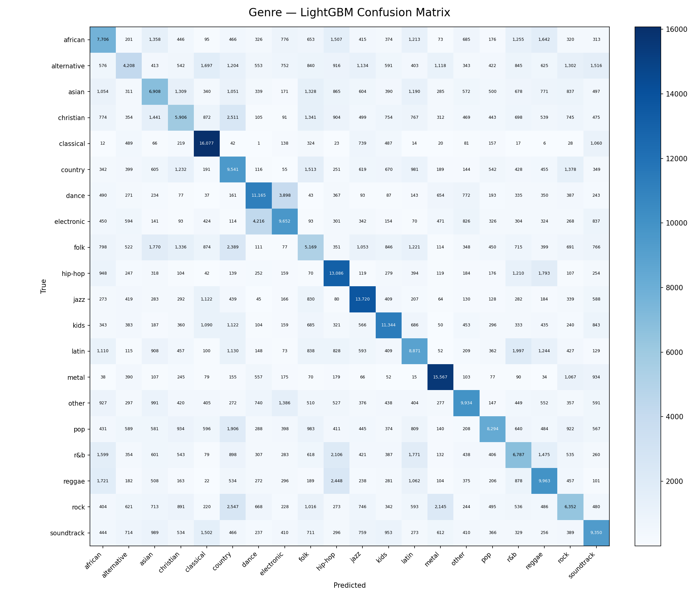 | 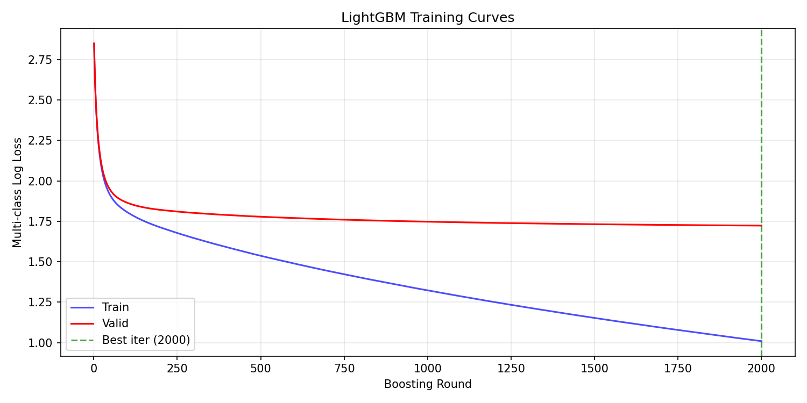 | 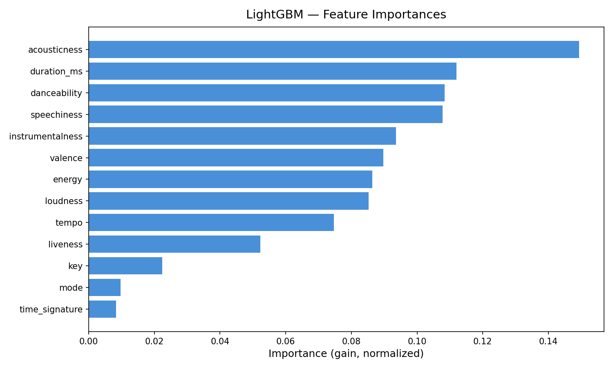 | 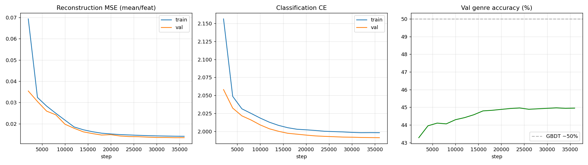 |

## Running it

> **Heads-up on portability:** the engine depends on a **162 GB `master.db`** and a **~9 GB FAISS index** built from ~266 GB of source data. These are **not** in this repo (see `.gitignore`) and can't realistically be shipped. The code, schema, and full pipeline are here and reproducible in principle, but a from-scratch build needs the source datasets and time. For a quick look, the demo above or the recordings are the best starting point.

This is a NixOS project; all tooling comes from the devshell.

```sh
# 1. Enter the dev environment (sets up .venv, C++/Rust/Python toolchains)
nix develop

# 2. Build the master database (C++ ETL — requires the raw source datasets)
cmake -S database -B database/build && cmake --build database/build
./database/build/master_db_builder

# 3. Train models + build the vector index (Python)
python model_training/train_genre_gbdt.py
python model_training/predict_genres.py
python model_training/train_sae.py
python model_training/embed_tracks.py
python model_training/build_faiss.py

# 4. Run the engine (FastAPI, defaults to 127.0.0.1:3000)
python -m backend.engine.main

# 5. Run a client (separate shell)
cd tui && cargo run --release              # terminal
cd frontend && npm install && npm run dev  # web, on http://127.0.0.1:5173
```

The web client's dev server proxies `/api` to the engine, so the browser stays same-origin;
point it elsewhere with `SONIC_ENGINE=http://host:port npm run dev`.

Configuration is via environment variables (see [`backend/engine/config.py`](backend/engine/config.py)) and a `backend/.env` file. The LLM fallback reads its provider/key from `.env`; without it, search falls back to the rule-based parser.

## Status

The engine is feature-complete: semantic search, playlist generation with transition optimization, artist/track details, similar-track retrieval with a two-stage FAISS + re-rank (from a result, a scanned file, or a track named by title/artist), and local-library identity matching. Mood classification is a planned phase-2 addition.

## License

Personal project — all rights reserved unless stated otherwise.
