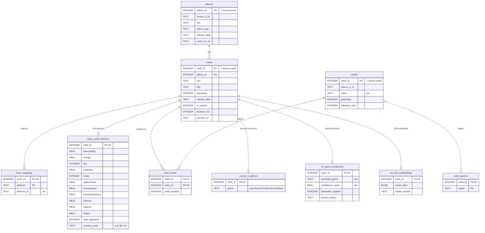

# master.db — Entity-Relationship Diagram

Integer-keyed, normalized schema. `track_id` / `artist_id` / `album_id` are the
reused source SQLite rowids. The `tracks` ↔ `artists` many-to-many is resolved by
the `track_artists` junction. The three `ml_*` / `source_b_*` tables and
`track_audio_features` are 1:1 satellites of `tracks` (same PK).



**Cardinality legend:** `||` = exactly one, `o{` = zero-or-many, `o|` = zero-or-one.
So `albums ||--o{ tracks` = one album has many tracks; `tracks ||--o| track_audio_features`
= a track has at most one feature row.

**Indexes** (`"idx"` tagged above): `idx_tracks_isrc`, `idx_track_mappings_platform_id`,
`idx_track_artists_artist_id`, `idx_artists_name`, `idx_source_b_genres_genre`,
`idx_ml_predictions_genre`, `idx_ml_predictions_confidence`. Track-keyed satellites need
no index — their `INTEGER PRIMARY KEY` *is* the rowid.
```
```
